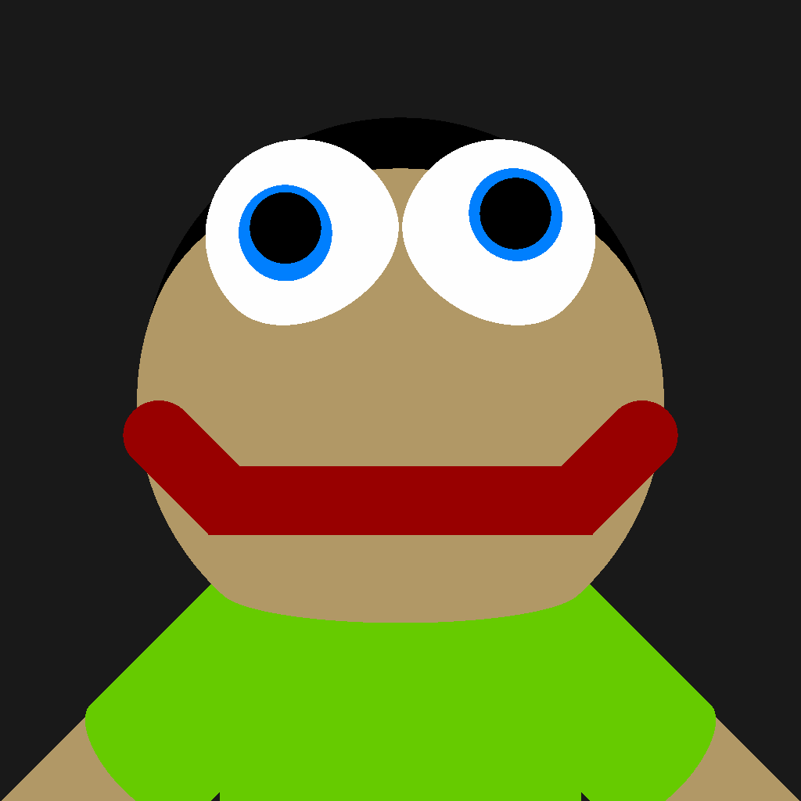

# CSCI5607 HW1A: Ray Caster - Noah Hendrickson

## Cool Picture :)


## How To Run:

A makefile is included in the project
In a linux terminal, input
```
> make cast
```
to compile the project. <br><br>

Input
```
> make run
```
to subsequently run the project. <br><br>

To do both at once, input
```
> make cast-run
```
<br>

If you want to easily change the input file, add 
```
"TXT=<file_path>/<file_name>.txt
```
to the end of your make command.

Output will be saved to a file called ```<file_name>.ppm```

## Input Specifications:
**!!!BEFORE GETTING INTO THE KEYWORDS!!!**<br>
**There is one important quirk for running it:**
- **you MUST have a folder called "outputs" in the same directory**

**!!!!!!!!!!!!!!!!!!!!!!!!!!!!!!!!!!!!!!!!!!!!!!!!!!!!!!!!!!!!!!!**<br>

This one is far easier than the previous homework. <br>
There are 10 keywords:
### Required Keywords
- imsize:
    - defines the width and height of the output image
    - arguments:
        - \<width> \<height>
        - must be positive, >= 1, ints or floats
        - floats will be rounded down
- eye:
    - defines position of the camera eye
    - arguments:
        - \<x> \<y> \<z>
        - must be ints or floats
        - represent x, y, and z coordinates of a point in world space
- viewdir:
    - define the direction the camera faces
    - arguments:
        - \<x> \<y> \<z>
        - must be ints or floats
        - CANNOT have all values be 0
        - 0 in this case is -9e-13 < x < 9e-13
- updir:
    - define the up direction of the camera
    - arguments:
        - \<x> \<y> \<z>
        - must be ints or floats
        - CANNOT have all values be 0
        - 0 in this case is -9e-13 < x < 9e-13
- hfov:
    - defines the horizontal field of view of the camera
    - arguments:
        - \<fov>
        - must be a positive int or float
        - must be between epsilon (defined in vec3.h) and 360
- bkgcolor:
    - defines the background color of the scene
    - arguments:
        - \<r> \<g> \<b>
        - must be positive int or float
        - must be between 0 and 1 inclusive for both
- all of these keywords must have exactly that number of arguments following them
    - however, the ordering of keywords is arbitrary
    - additionally, there can be arbitrary whitespace between arguments and keywords

### Optional Keywords
- projection:
    - switches ray caster mode to parallel
    - argument:
        - \<parallel>
        - a string, must be spelled exactly "parallel"
- mtlcolor:
    - defines the color of the following objects
    - arguments:
        - \<r> \<g> \<b>
        - must be positive int or float
        - must be between 0 and 1 inclusive for both
    - an arbitrary number or spheres and cylinders can follow mtlcolor
    - each sphere/cylinder will inherit the previously defined material
    - once a keyword besides sphere/cylinder is encountered, the current material is ended
    - in order to add another sphere or cylinder, another material has to be defined
- sphere:
    - puts a sphere into the scene
    - arguments:
        - \<cx> \<cy> \<cz> \<rad>
        - cx, cy, cz define the point that is the center of the sphere
        - rad is the radius of the circle
        - cx,cy,cz must be ints or floats
        - rad is a float or int and must be > epsilon (defined in vec3.h)
- cylinder
    - puts a cylinder into the scene
    - arguments:
        - \<cx> \<cy> \<cz> \<dx> \<dy> \<dz> \<rad> \<len>
        - cx,cy,cz define the center of the bottom cap of the cylinder
        - dx,dy,dz define the direction that the rest of the cylinder follows
        - rad is the radius of the cylinder, len is the length 
        - cx,cy,cz must be ints or floats
        - dx,dy,dz must be ints or floats
        - dx,dy,dz CANNOT all be < epsilon (defined in vec3.h)
        - rad must be a int or float and cannot be < epsilon
        - len must be a int or float and cannot be < epsilon
- all of these keywords are optional 
- projection and mtlcolor can be arbitarily ordered with arbitrary whitespace
- the circles and cylinders following mtlcolor can be arbitrarily ordered
    - once another keyword is encountered, a circle/cylinder without another mtlcolor will throw an error
