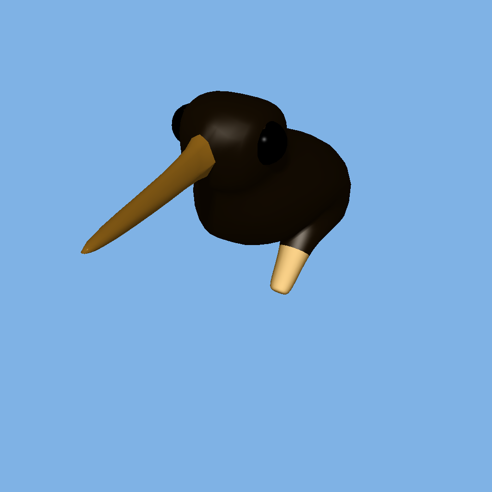

# CSCI5607 HW1C: Ray Tracer - Noah Hendrickson

## Cool Picture :)

## Updates:

I'm not going to be going in depth for the commands to run and such as 
nothing much has changed in regards to that.  
I will only mention the newly added/updated commands.

## Commands added:
- v
    - specifies a vertex in the scene
    - arguments are \<x> \<y> \<z> and specify scene location
    - x,y,z must be floats/ints
    - can be placed anywhere in input file
- vn 
    - specifies a normal direction
    - arguments are \<nx> \<ny> \<nz> and specify scene direction
    - x,y,z must be floats/ints and must not be all 0
    - can be placed anywhere in input file
- vt
    - specifies texture coordinates
    - arguments are \<u> \<v>
    - must be floats/ints
    - can be placed anywhere in input file
- f
    - specifies a triangle face and associated normal directions/texture coordinates
    - arguments are:
        - \<v1> \<v2> \<v3> for a flat shaded, textureless triangle
        - \<v1>//\<vn1> \<v2>//\<vn2> \<v3>//\<vn3> for a smooth shaded, textureless triangle
        - \<v1>/\<vt1> \<v2>/\<vt2> \<v3>/\<vt3> for a flat shaded, textured triangle
        - \<v1>/\<vt1>/\<vn1> \<v2>/\<vt2>/\<vn2> \<v3>/\<vt3>/\<vn3> for a smooth shaded, textured triangle
    - all face definitions must follow a material definition
    - any face that defines a textured triangle must follow either a bump definition or texture definition as well
    - can reference vertices/vertex normals/texture coordinates that have not been defined yet
- texture
    - specifies a texture to apply to all following faces/spheres
    - arguments are \<ppmfile>
    - must be a valid path to a ppm file which has the entire header on one line and is P3
    - does not reset the currently specified material/bump
- bump
    - specifies a normal map to apply to all following faces/spheres
    - arguments are \<ppmfile>
    - must be a valid path to a ppm file which has the entire header on one line and is P3
    - does not reset the currently specified material/bump
- material
    - only update is that specifying a new material WILL reset the currently specified bump/texture
- extras
    - Quads can technically be specified when specifying a face
    - There is a very strict requirement for them because I was just wanting to load an OBJ file without much work
    - arguments are \<v1>/\<vt1>/\<vn1> \<v2>/\<vt2>/\<vn2> \<v3>/\<vt3>/\<vn3> \<v4>/\<vt4>/\<vn4> after an f
    - the texture coordinates will be ignored and thus should not be specified previously using vt
    - the quads will be broken up into two triangles
    - I also did not add normal mapping/texturing to cylinders so neither will be applied to those
- makefile
    - command 'raytracer1b' to compile was renamed to 'raytracer1c'
Outside of these updated/added things, everything else is the same. 

